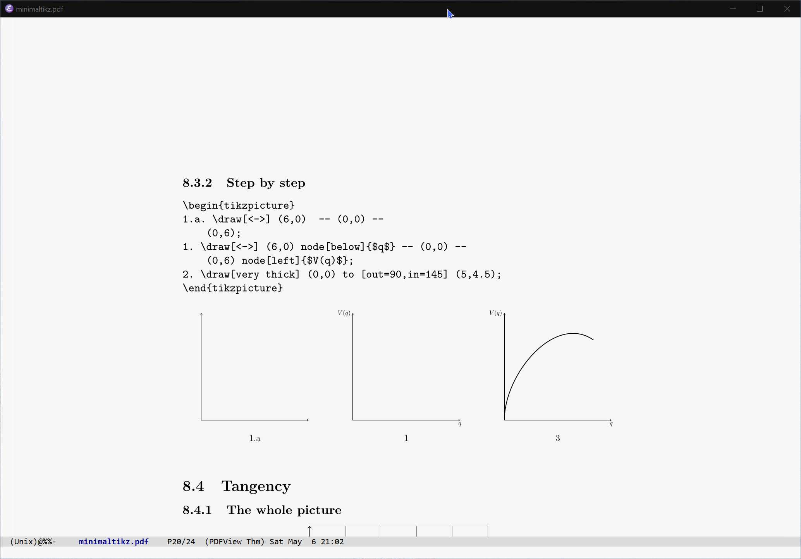

# pdf-view-pagemark

Show an indicator of the remaining text in PDF page.

## Demo



## Installation

`pdf-view-pagemark` is now an elpa package, you can get it directly
with `use-package`.

```elisp
(use-package pdf-view-pagemark
  :custom (pdf-view-pagemark-timeout 2)
  :hook (pdf-view-mode . pdf-view-pagemark-mode))
```

Or

```elisp
(add-to-list 'load-path "<path-to-pagemark>")

(require 'pdf-view-pagemark)

(setq pdf-view-pagemark-timeout 2)
(add-hook pdf-view-mode-hook 'pdf-view-pagemark-mode)
```

Or

```elisp

(use-package pdf-view-pagemark
  :after pdf-tools
  :load-path "~/.emacs.d/site-lisp/pdf-view-pagemark"
  :custom (pdf-view-pagemark-timeout 2)
  :hook (pdf-view-mode . pdf-view-pagemark-mode))
```

## Contributors

<a href = "https://github.com/kimim/pdf-view-pagemark/graphs/contributors">
  
</a>
